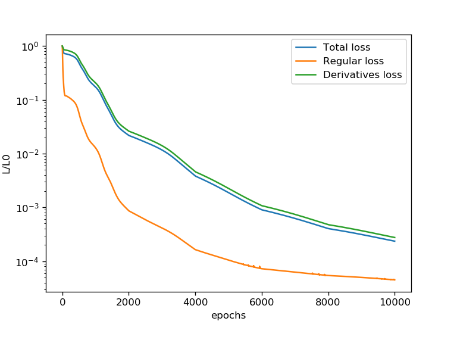
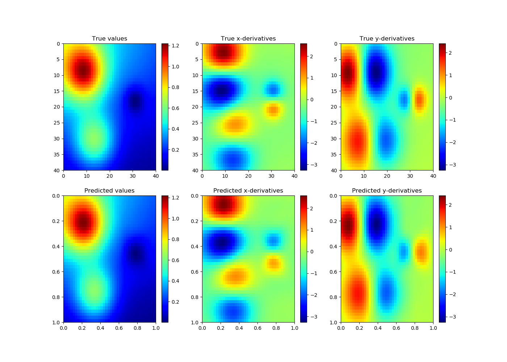

# SobolevPytorch
An implementation of a neural network training routine using available derivative information in Pytorch.

Original paper:

Czarnecki, W. M., Osindero, S., Jaderberg, M., Swirszcz, G., & Pascanu, R. (2017). Sobolev training for neural networks. In Advances in Neural Information Processing Systems (pp. 4278-4287).

Using Sobolev training we can efficiently reduce the overall loss and are able to get better approximations of the derivatives of the inputs.

## Tested on
<ul>
<li>Python 3.8</li>
<li>Numpy 1.19.4</li>
<li>Pytorch 1.7.0</li>
<li>Matplotlib 3.1.2</li>
</ul> 

## Example
Test on Franke's function

Training on 100 equidistant points between 0 and 1 yields the following convergence behavior: 

Testing on 1600 test points in the parametric space yields the following visualized results which are in good accordance with the target.

